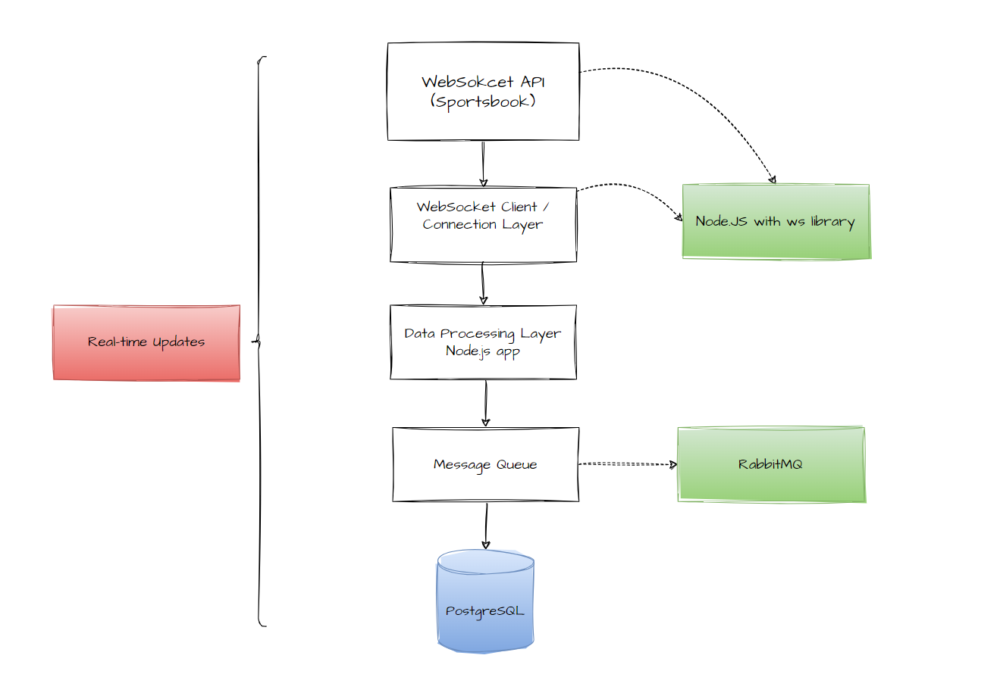

# Design Question Response

## Scenario
You need to design a system that:
- Receives real-time data via WebSocket from a sportsbook API (fixture updates, odds changes, bet placements)
- Stores this data in a database for historical analysis
- Handles high volume (thousands of updates per minute)

## Question
How would you design and implement this real-time data pipeline?

## 1. Architecture Diagram
Below is the architecture diagram for the real-time data pipeline:

Explanation: The WebSocket client connects to the API and pushes data to a processing layer for validation and enrichment. A message queue decouples the processing from database writes to handle high volume and ensure reliability. No cache is included initially, but Redis could be added for temporary storage if needed.

## 2. Technology Choices
- **WebSocket Client Library**: ws (for Node.js). It is lightweight, efficient for high-volume streams, and supports automatic reconnection with exponential backoff. It's simple for server-side use and has low overhead compared to Socket.io, which is more suited for client-server bidirectional communication.
- **Database**: PostgreSQL. It is a robust relational database with excellent support for structured data (e.g., tables for fixtures, odds, bets) and JSONB for flexible event payloads. It handles high write loads with indexing and can scale with partitioning. Alternatives like MongoDB could be used for unstructured data, but PostgreSQL is better for historical analysis with SQL queries.
- **Message Queue**: RabbitMQ. It provides reliable queuing with AMQP protocol, supports high throughput (thousands of messages per minute), and allows for easy scaling with clustering. It ensures no data loss with acknowledgments and retries. Kafka could be an alternative for even higher volume or distributed setups, but RabbitMQ is simpler for this scale.
- **Programming Language/Framework**: Node.js with Express. Node.js is excellent for real-time I/O operations like WebSocket handling, with non-blocking async nature for high concurrency. Express adds a lightweight server framework for the processing layer, making it easy to handle routes, middleware for validation, and integration with queues. Alternatives like Python with FastAPI could work for simplicity, but Node.js excels in performance for event-driven systems.

## 3. Data Model
- **Tables**:
  - `events_raw` (for all incoming events before processing): id (PK, auto-increment), event_type (string, e.g., "fixture_update", "odds_change", "bet_placement"), payload (JSONB for the raw data), timestamp (timestamptz), source (string, e.g., "websocket").
  - `fixtures`: id (PK), fixture_id (unique string from API), sport_id (integer), tournament_id (integer), home_team (string), away_team (string), start_time (timestamptz), status (string), updated_at (timestamptz).
  - `odds_changes`: id (PK), fixture_id (FK to fixtures), market_type (string, e.g., "1X2"), option_id (string), odd_value (decimal), timestamp (timestamptz).
  - `bets`: id (PK), bet_id (unique string from API), user_id (string), fixture_id (FK to fixtures), amount (decimal), odd (decimal), potential_win (decimal), status (string), timestamp (timestamptz).

- **Indexes**:
  - `events_raw`: Index on event_type and timestamp for fast filtering.
  - `fixtures`: Unique index on fixture_id, index on updated_at for historical queries.
  - `odds_changes`: Composite index on fixture_id, market_type, timestamp for quick lookups of changes.
  - `bets`: Index on user_id and timestamp for user history, and on fixture_id for event-based analysis.

- **Handle Different Event Types**: The data processing layer parses the event type from the WebSocket message (e.g., based on a 'type' field in the payload). Use conditional logic to route to the appropriate table (e.g., if type == 'odds_change', insert to odds_changes; if 'bet_placement', to bets). All events are logged in `events_raw` for audit.

## 4. Key Considerations
- **Connection Reliability**: Implement reconnection logic in the WebSocket client with exponential backoff (e.g., retry after 1s, 2s, 4s, max 30s). Use heartbeats (ping/pong) to detect drops. If disconnected, log the event and buffer unsent data in memory or a local queue until reconnect.
- **Data Validation**: In the processing layer, use a schema validator like Joi to check incoming data (e.g., odd is positive number, fixture_id is string). Discard invalid messages with logging, or send to a dead-letter queue in RabbitMQ for later review.
- **Performance**: Use RabbitMQ to buffer bursts (thousands/min); process in batches (e.g., insert 100 events at once to DB). Use Node.js clusters for multi-core processing. Monitor queue length to scale workers dynamically.
- **Error Handling**: If DB write fails, retry 3 times with backoff; if fails, log to error queue and alert (e.g., via Slack). Use transactions for atomic writes.
- **Monitoring**: Use Prometheus for metrics (e.g., message rate, queue size, DB latency, reconnects count). Logs with Winston to ELK stack. Set alerts for high queue length or frequent reconnects.

## 5. Scaling Strategy
- **Message Volume Increases 10x**: Scale horizontally by adding more Node instances for the client and processor (using PM2 or Kubernetes). RabbitMQ clustering for queue, and sharding PostgreSQL (e.g., by sport_id or timestamp with Citus extension).
- **Support Multiple WebSocket Sources**: Create separate WebSocket clients per source, tag events with source_id in the payload, and use RabbitMQ topics for routing (e.g., 'source1.odds').
- **Real-Time Processing Before Storing**: Add Apache Kafka Streams or Node.js event emitter in the processing layer for real-time computations (e.g., aggregate odds changes). Store raw data in S3 for archive and processed in DB for quick queries.